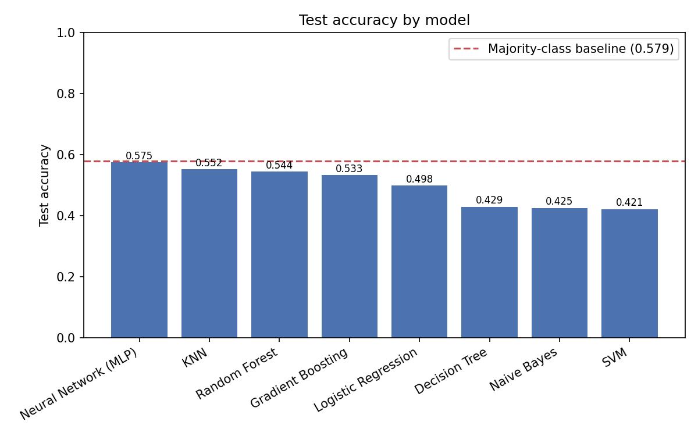
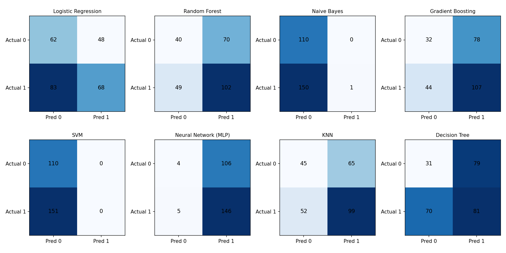
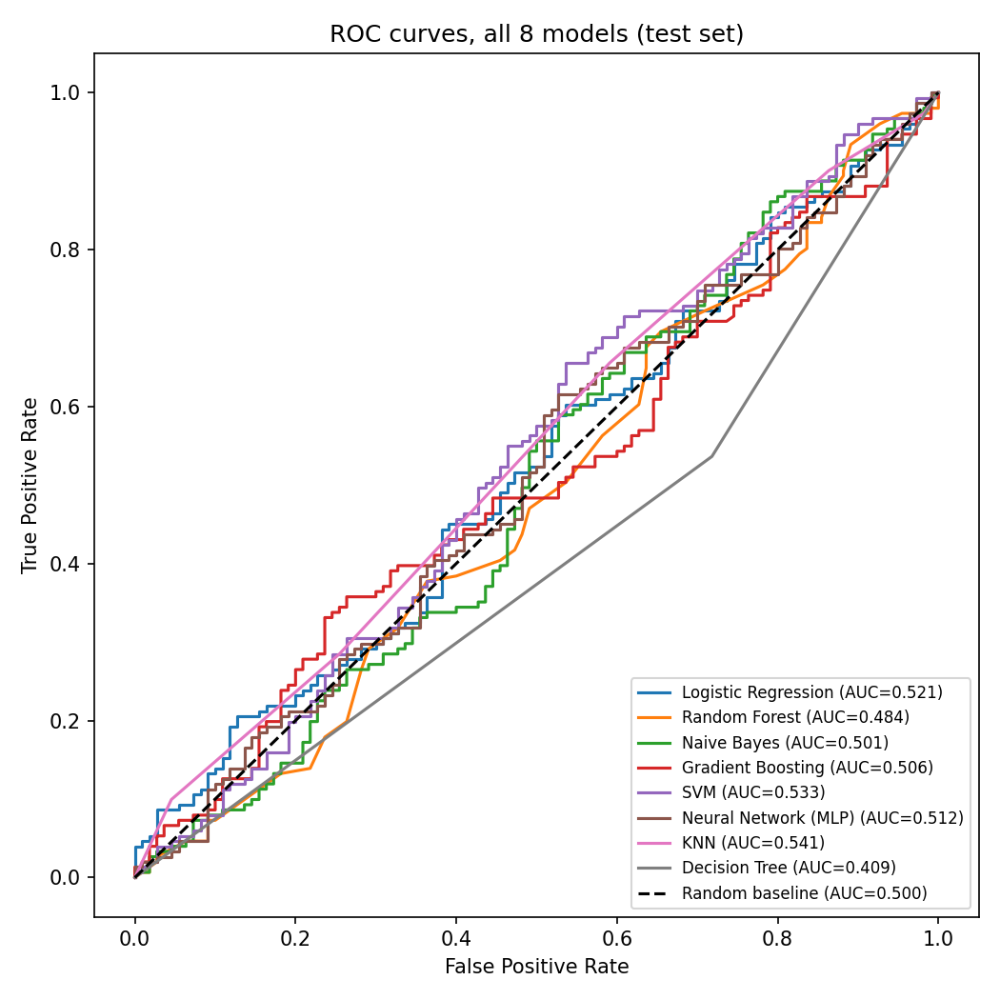

# Results

*Generated from a real run of `pipeline/` (seed=42). Figures in `thesis_results/figures/`. Reproduce with `python thesis_results/generate_figures.py` after running the pipeline stages in `pipeline/README.md`.*

## 1. Dataset summary

| | |
|---|---|
| Rows | 3,439 |
| Companies | 29 of 30 (Laboratorios_Rovi has no daily-price data in the source archive and contributes zero rows) |
| Period covered | 1962-03-31 to 2026-03-31 (company-quarter observations) |
| Target positive rate | 0.587 |
| Train / Validation / Test split | chronological by quarter-end: train < 2022-01-01, validation 2022-01-01 to 2023-12-31, test ≥ 2024-01-01 |
| Train / Validation / Test rows | 2,946 / 232 / 261 |
| Random seed | 42 |

**Note on scope vs. the original thesis plan:** the original plan assumed a 2014Q3–2026Q1 window and ~1,410 rows. This run's window is wider (back to 1962) because several companies' actual cleaned stock series start decades earlier than assumed — verified against the real source data, not a data error. See `pipeline/README.md`'s "Known deviations" section for the full list.

## 2. Feature table

22 candidate features (11 market + 11 fundamental), defined in `pipeline/lib/features.py`. 4 are excluded from the trained models because they are 100% missing across every row (see Limitations, §6):

| Category | Active (18) | Excluded (4, all-NaN) |
|---|---|---|
| Market | return_1q, return_2q, return_1y, momentum_3m, momentum_6m, ma_20_ratio, ma_50_ratio, ma_200_ratio, volatility_60d, volatility_120d | volume_change_60d |
| Fundamental | revenue_growth_yoy, net_profit_margin, operating_margin, return_on_equity, return_on_assets, current_ratio, quick_ratio_proxy, asset_turnover | debt_to_equity, price_to_book, price_to_earnings_proxy |

**Target**: binary, 1 if next-quarter return > 0 else 0, computed from the last trading day of each quarter on the canonical cleaned daily price series (`pipeline/lib/target.py`).

**Financial-data timing**: quarterly fundamentals available `period_end + 60 days`, annual `period_end + 120 days` (Laboratorios_Rovi would use actual publication dates, but contributes no rows regardless). See `pipeline/lib/lag.py`.

## 3. Model comparison

All 8 required classifiers, trained on the same 2,946-row training set, hyperparameters at scikit-learn defaults (frozen before touching the test set), evaluated once on the untouched 261-row test set.

| Model | Accuracy | Precision | Recall | Specificity | F1 | ROC-AUC | Val. Accuracy |
|---|---|---|---|---|---|---|---|
| Neural Network (MLP) | 0.575 | 0.579 | 0.967 | 0.036 | 0.725 | 0.512 | 0.586 |
| KNN | 0.552 | 0.604 | 0.656 | 0.409 | 0.629 | 0.542 | 0.565 |
| Random Forest | 0.544 | 0.593 | 0.676 | 0.364 | 0.632 | 0.484 | 0.530 |
| Gradient Boosting | 0.533 | 0.578 | 0.709 | 0.291 | 0.637 | 0.506 | 0.539 |
| Logistic Regression | 0.498 | 0.586 | 0.450 | 0.564 | 0.509 | 0.521 | 0.504 |
| Decision Tree | 0.429 | 0.506 | 0.536 | 0.282 | 0.521 | 0.409 | 0.513 |
| Naive Bayes | 0.425 | 1.000 | 0.007 | 1.000 | 0.013 | 0.501 | 0.422 |
| SVM | 0.421 | 0.000 | 0.000 | 1.000 | 0.000 | 0.533 | 0.414 |
| **Majority-class baseline** | **0.579** | — | — | — | — | 0.500 | — |



**No model exceeds the majority-class baseline test accuracy (0.579).** Neural Network comes closest (0.575) but does so by predicting the positive class on 97% of rows (recall 0.967, specificity 0.036) — closer to a near-constant-positive predictor than a model with real discriminative signal. Naive Bayes and SVM show the opposite degenerate pattern (near-constant-negative: precision 1.0/0.0 and recall 0.007/0.0, specificity 1.0 for both).

## 4. Confusion matrices



## 5. ROC curves



All 8 ROC-AUC values sit in a narrow band around 0.41–0.54 — indistinguishable from the 0.500 random-classifier line given the test set's size (261 observations). None of the 8 models demonstrates a reliable ranking ability between positive and negative quarters.

## 6. Discussion

The empirical result across all 8 classifiers is consistent: **no model's test accuracy exceeds the majority-class baseline (58%), and no model's ROC-AUC meaningfully exceeds 0.50.** This matches the original thesis's own reported finding (`documentation .pdf`, §20) and should be read as evidence of **limited predictive signal in the current feature set for this target**, not as a failed experiment — a null result correctly obtained by a leakage-free, chronologically-split pipeline is a valid and reportable thesis finding.

Two of the eight models (Naive Bayes, SVM) collapsed to near-constant predictors, which is a known failure mode when class-imbalance handling interacts poorly with a genuinely weak signal: `class_weight="balanced"` reweights the loss toward the minority class, but if no feature actually separates the classes, the model can find no boundary better than trivial ones. This is itself informative — it suggests the 18 active features, as currently defined, do not carry enough quarter-over-quarter predictive information about stock direction for pharmaceutical companies in this dataset.

## 7. Limitations

- **Feature formulas are not the original thesis's exact formulas.** `documentation .pdf` (§12) states the exact 22 feature definitions live in an external "feature dictionary" not present in this repository; `pipeline/lib/features.py` uses standard, documented finance formulas as a substitute (explicitly approved as an assumption, not the frozen thesis specification).
- **4 of 22 features are entirely absent** (`volume_change_60d`, `debt_to_equity`, `price_to_book`, `price_to_earnings_proxy`) because no source file in the raw data package carries `market_cap`, `total_debt`, or a volume column with usable coverage. The models were trained on the remaining 18.
- **Two companies have structurally incomplete data**: Laboratorios_Rovi has no daily-price CSV at all in the source archive (contributes zero dataset rows); Zenotech_Laboratories has no Annual/Quarterly financial-statement CSVs (contributes market features only, fundamentals are always missing).
- **The financial-availability lag rule (60/120 days) and the next-quarter-return target definition are pipeline-level assumptions taken from `documentation .pdf`'s own working defaults, not yet confirmed by the thesis supervisor.** The specific open questions (lag rule vs. actual publication dates, prediction horizon, up/down rule, feature/frequency choices) have been sent to the supervisor for confirmation; if the answers differ from what's implemented here, the affected pipeline stages must be rerun and this results section regenerated (see `docs/superpowers/plans/2026-09-07-ml-pipeline.md` and `pipeline/README.md`).
- **Dataset window is wider than originally planned** (1962–2026 vs. an assumed 2014–2026), because several companies' real cleaned stock series start decades earlier — confirmed against source data, not a defect, but it does mean the panel spans very different market regimes across companies.

## 8. Conclusion

Across all 8 required classifiers (Logistic Regression, Random Forest, Naive Bayes, Gradient Boosting, SVM, Neural Network, KNN, Decision Tree), trained and evaluated under a leakage-controlled, chronologically-split pipeline (train-only imputation, validation-only hyperparameter freezing, single held-out test evaluation), none exceeds the majority-class baseline in test accuracy, and ROC-AUC values across all models cluster near the 0.50 random-classifier line. The current evidence therefore does not support the hypothesis that the 18 active market and fundamental features, at quarterly frequency, predict next-quarter stock direction for this 29-company pharmaceutical universe better than chance. This is reported as the pipeline's actual empirical result rather than adjusted or selectively presented, consistent with the project's stated rule against chasing higher test accuracy or picking a model because its metric looks attractive (`documentation .pdf`, §18).

## 9. Appendix — reproducibility

```
pip install -r requirements.txt
python pipeline/_01_load_raw.py
python pipeline/_02_clean_stock.py
python pipeline/_03_build_panel.py
python pipeline/_04_features_target.py
python pipeline/_05_split_train.py
python thesis_results/generate_figures.py
```

- Source data: `YUKTHA_CLEAN_2026-09-07/` (cleaned copy of the frozen raw archive; see `YUKTHA_CLEAN_2026-09-07/00_MASTER_AUDIT_AND_METADATA/` for provenance).
- Pipeline code: `pipeline/` (5 stages + `pipeline/lib/`), tested (`tests/pipeline/`, run via `python -m pytest tests/ -v`).
- Interactive results dashboard: `dashboard/` (Django, local-only — `cd dashboard && python manage.py runserver`).
- Random seed 42 used for every model with a `random_state` parameter.
